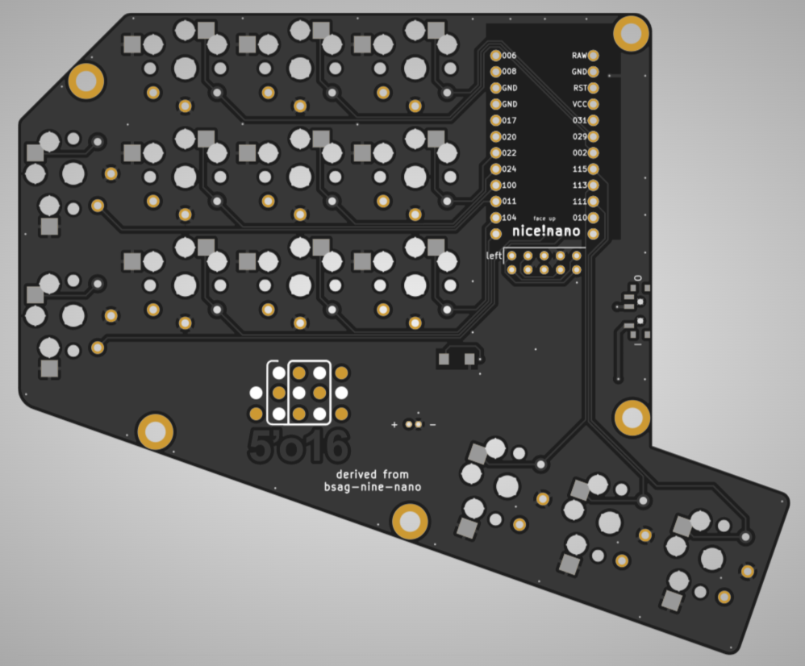
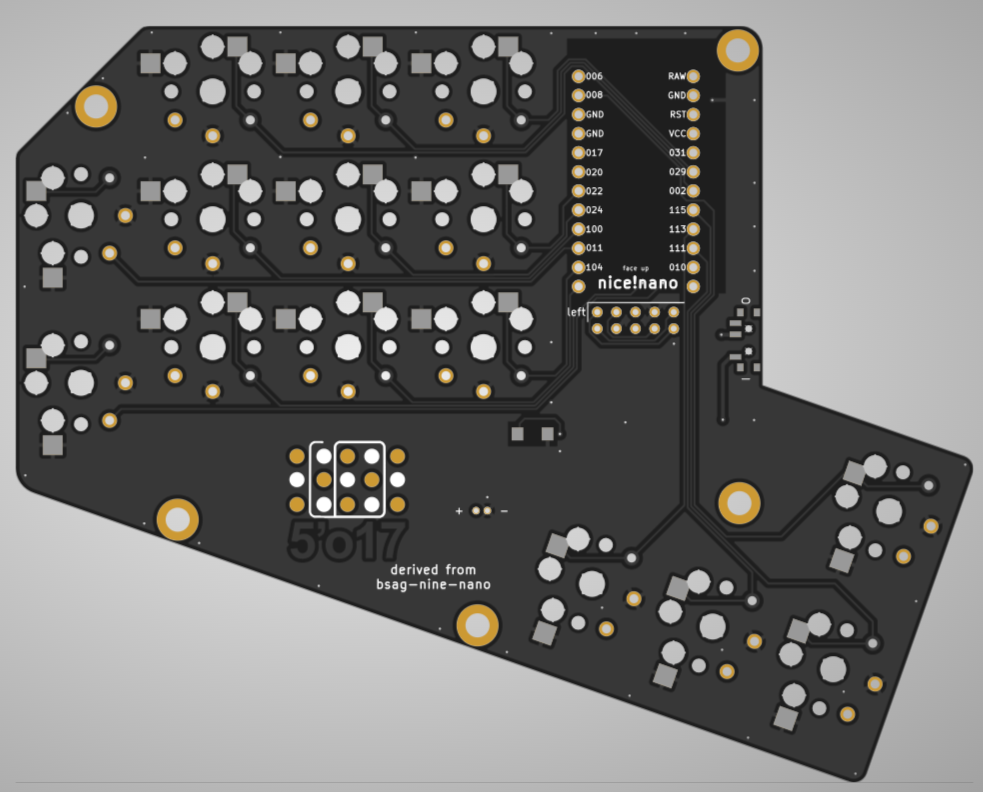

# Nine Variants "5'o16" and "5'o17"

In this author's humble opinion, the original design of the Nine keyboard was intriguing but introduced some compromises that made it more difficult to adapt to one-handed, chorded layouts such as [Artsey, Ardux and Taipo](https://inkeys.wiki/).

As a result, the original Nine design was extended to add either 5 more or 6 more keys on each side, while still retaining the overall design principles.

At this time, only the PCB files are available.  I have not yet worked on case files.

## Variant "5'o16"

This variant has 14 keys per hand, and adds one more pinky key (rotated 90 degrees), an upper row of three keys (one for each of the remaining fingers), and one more 1.5U thumb key that is slightly distal (i.e., further from the fingers).

When used in a two-handed configuration, such a split keyboard has 28 keys total.

As such, this variant is easily mapped to the Artsey, Ardux or Taipo chorded layouts, as well as other emerging layouts that might be derived from or inspired by the same.  The added finger keys make it possible to use these layouts directly, or add other frequently used keys that are readily available.  The added 1.5U thumb key opens up new possibilities for chording combinations, or it could also serve as a modifier or layer selector.

## Variant "5'o17"

This variant has 15 keys per hand, and is essentially identical to variant "5'o16" but adds an additional 1U thumb key (just above the new 1.5U distal thumb key).

When used in a two-handed configuration, such a split keyboard has 30 keys total.

Possible uses for this new thumb key could include a modifier, layer selector, or other mode-switching control.  It does not seem well-suited for thumb-chording, but could be used in other ways.

